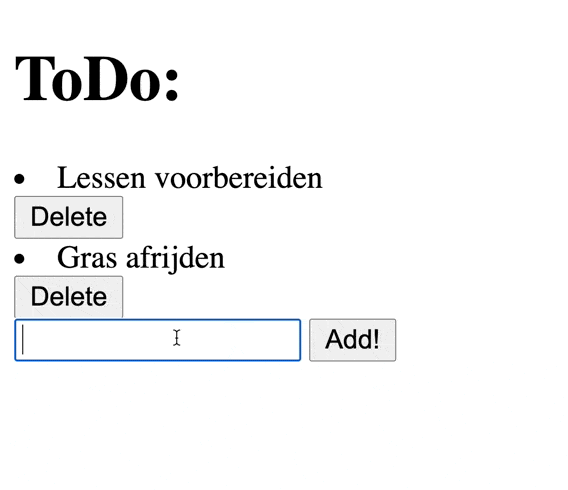

# php-database-todo-app
A simple TODO App written in PHP that uses a MySQL database.

Probeer de opdracht eerst zelf eens voor je naar de code gaat kijken.

## Opdracht

- We hebben een overzichtspagina van alle todo's.
- Onderaan de pagina is er een formulier om een nieuwe todo toe te voegen.
- Naast elke todo staat een knopje om het TODO-item te verwijderen

### Resultaat

